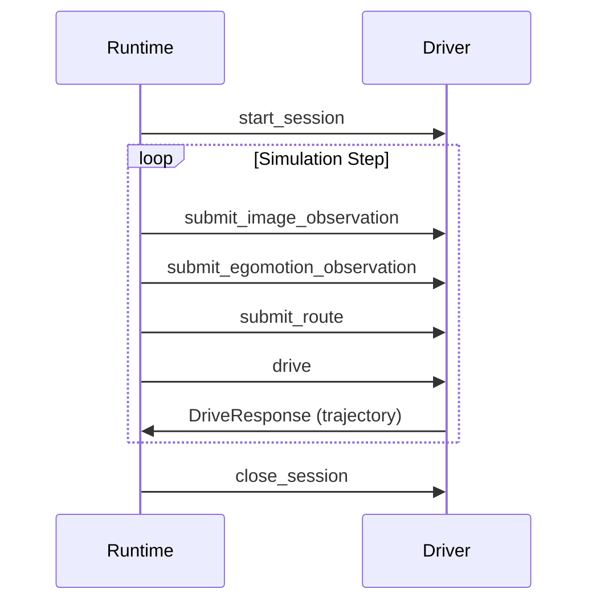

The Driver Service (`EgodriverService`) implements the autonomous driving policy. It receives sensor observations and produces planned trajectories for the ego vehicle.

## Service Definition

```protobuf
service EgodriverService {
    rpc start_session (DriveSessionRequest) returns (common.SessionRequestStatus);
    rpc close_session (DriveSessionCloseRequest) returns (common.Empty);
    rpc submit_image_observation (RolloutCameraImage) returns (common.Empty);
    rpc submit_egomotion_observation (RolloutEgoTrajectory) returns (common.Empty);
    rpc submit_route (RouteRequest) returns (common.Empty);
    rpc submit_recording_ground_truth (GroundTruthRequest) returns (common.Empty);
    rpc drive (DriveRequest) returns (DriveResponse);
    rpc get_version (common.Empty) returns (common.VersionId);
    rpc shut_down (common.Empty) returns (common.Empty);
}
```

## Methods

### start_session

Initialize a driving session with vehicle and scene configuration.

<ParamField body="session_uuid" type="string" required>
  Unique identifier for this driving session
</ParamField>

<ParamField body="random_seed" type="uint64" required>
  Random seed for reproducible behavior
</ParamField>

<ParamField body="rollout_spec" type="RolloutSpec" required>
  Vehicle specification
  
  <Expandable title="RolloutSpec.VehicleDefinition">
    <ParamField body="available_cameras" type="AvailableCamera[]">
      List of cameras available on the vehicle with intrinsics and extrinsics
    </ParamField>
  </Expandable>
</ParamField>

<ParamField body="debug_info" type="DebugInfo" optional>
  Debug information (not present in benchmark runs)
  
  <Expandable title="DebugInfo">
    <ParamField body="scene_id" type="string">
      Scene identifier for debugging
    </ParamField>
  </Expandable>
</ParamField>

### submit_image_observation

Provide camera images to the driver for perception.

<ParamField body="session_uuid" type="string" required>
  Session identifier
</ParamField>

<ParamField body="camera_image" type="CameraImage" required>
  <Expandable title="CameraImage">
    <ParamField body="frame_start_us" type="uint64">
      Frame capture start timestamp (microseconds)
    </ParamField>
    
    <ParamField body="frame_end_us" type="uint64">
      Frame capture end timestamp (for rolling shutter)
    </ParamField>
    
    <ParamField body="image_bytes" type="bytes">
      Encoded image data (PNG/JPEG)
    </ParamField>
    
    <ParamField body="logical_id" type="string">
      Camera identifier (e.g., "camera_front_wide_120fov")
    </ParamField>
  </Expandable>
</ParamField>

### submit_egomotion_observation

Provide estimated ego vehicle trajectory (localization output).

<ParamField body="session_uuid" type="string" required>
  Session identifier
</ParamField>

<ParamField body="trajectory" type="Trajectory" required>
  Estimated ego rig pose as active transform local→rig_est.
  
  <Note>
    This can diverge from the true local→rig transform when error models are enabled.
  </Note>
</ParamField>

<ParamField body="dynamic_state" type="DynamicState" required>
  Estimated velocities and accelerations at current timestamp in rig frame.
  May include noise when error models are active.
</ParamField>

### submit_route

Provide high-level route waypoints to the driver.

<ParamField body="session_uuid" type="string" required>
  Session identifier
</ParamField>

<ParamField body="route" type="Route" required>
  <Expandable title="Route">
    <ParamField body="timestamp_us" type="uint64">
      Timestamp at which the route is valid
    </ParamField>
    
    <ParamField body="waypoints" type="Vec3[]">
      Waypoints expressed in rig frame at the provided timestamp
    </ParamField>
  </Expandable>
</ParamField>

### submit_recording_ground_truth

Provide ground truth trajectory from recording (for testing/validation).

<ParamField body="session_uuid" type="string" required>
  Session identifier
</ParamField>

<ParamField body="ground_truth" type="GroundTruth" required>
  <Expandable title="GroundTruth">
    <ParamField body="timestamp_us" type="uint64">
      Timestamp at which the ground truth is valid
    </ParamField>
    
    <ParamField body="trajectory" type="Trajectory">
      Ground-truth trajectory from recording (actual path followed).
      Each pose is expressed in rig frame at the provided timestamp.
    </ParamField>
  </Expandable>
</ParamField>

### drive

Request a planned trajectory from the driver.

<ParamField body="session_uuid" type="string" required>
  Session identifier
</ParamField>

<ParamField body="time_now_us" type="uint64" required>
  Current simulation time (microseconds)
</ParamField>

<ParamField body="time_query_us" type="uint64" required>
  Time for which trajectory is requested
</ParamField>

<ParamField body="renderer_data" type="bytes" optional>
  Optional arbitrary data from renderer for advanced use cases
</ParamField>

<ResponseField name="trajectory" type="Trajectory">
  Planned trajectory as active transform local→rig_est produced by the driver
</ResponseField>

<ResponseField name="debug_info" type="DebugInfo" optional>
  <Expandable title="DebugInfo">
    <ResponseField name="unstructured_debug_info" type="bytes">
      Binary debug data with custom serialization
    </ResponseField>
    
    <ResponseField name="sampled_trajectories" type="Trajectory[]">
      Alternative trajectories considered by planner
    </ResponseField>
  </Expandable>
</ResponseField>

### close_session

Release resources for a session.

<ParamField body="session_uuid" type="string" required>
  Session identifier to close
</ParamField>

## Usage Example

From `alpasim_runtime/services/driver_service.py`:

```python
from alpasim_grpc.v0 import egodriver_pb2, egodriver_pb2_grpc
import grpc

# Connect to driver service
channel = grpc.insecure_channel('localhost:50051')
driver_stub = egodriver_pb2_grpc.EgodriverServiceStub(channel)

# Start session
session_request = egodriver_pb2.DriveSessionRequest(
    session_uuid="my-session",
    random_seed=42,
    rollout_spec=egodriver_pb2.DriveSessionRequest.RolloutSpec(
        vehicle=egodriver_pb2.DriveSessionRequest.RolloutSpec.VehicleDefinition(
            available_cameras=camera_specs
        )
    )
)
driver_stub.start_session(session_request)

# Submit observations
driver_stub.submit_image_observation(
    egodriver_pb2.RolloutCameraImage(
        session_uuid="my-session",
        camera_image=egodriver_pb2.RolloutCameraImage.CameraImage(
            frame_start_us=t_start,
            frame_end_us=t_end,
            image_bytes=image_data,
            logical_id="camera_front_wide_120fov"
        )
    )
)

driver_stub.submit_egomotion_observation(
    egodriver_pb2.RolloutEgoTrajectory(
        session_uuid="my-session",
        trajectory=ego_trajectory,
        dynamic_state=ego_state
    )
)

# Request driving plan
response = driver_stub.drive(
    egodriver_pb2.DriveRequest(
        session_uuid="my-session",
        time_now_us=current_time,
        time_query_us=query_time
    )
)

planned_trajectory = response.trajectory
print(f"Planned {len(planned_trajectory.poses)} poses")

# Clean up
driver_stub.close_session(
    egodriver_pb2.DriveSessionCloseRequest(session_uuid="my-session")
)
```

## Data Flow

The driver service follows this typical workflow:

1. **Session Initialization**: Configure vehicle and scene
2. **Observation Loop**:
   - Receive camera images via `submit_image_observation`
   - Receive localization via `submit_egomotion_observation`
   - Receive route via `submit_route`
3. **Planning**: Generate trajectory with `drive`
4. **Session Cleanup**: Close session when done



## Related

- [SensorSim Service](/api/grpc/sensorsim) - Generates camera images
- [Controller Service](/api/grpc/controller) - Executes planned trajectories
- [Runtime Module](/api/runtime) - Orchestrates driver service calls