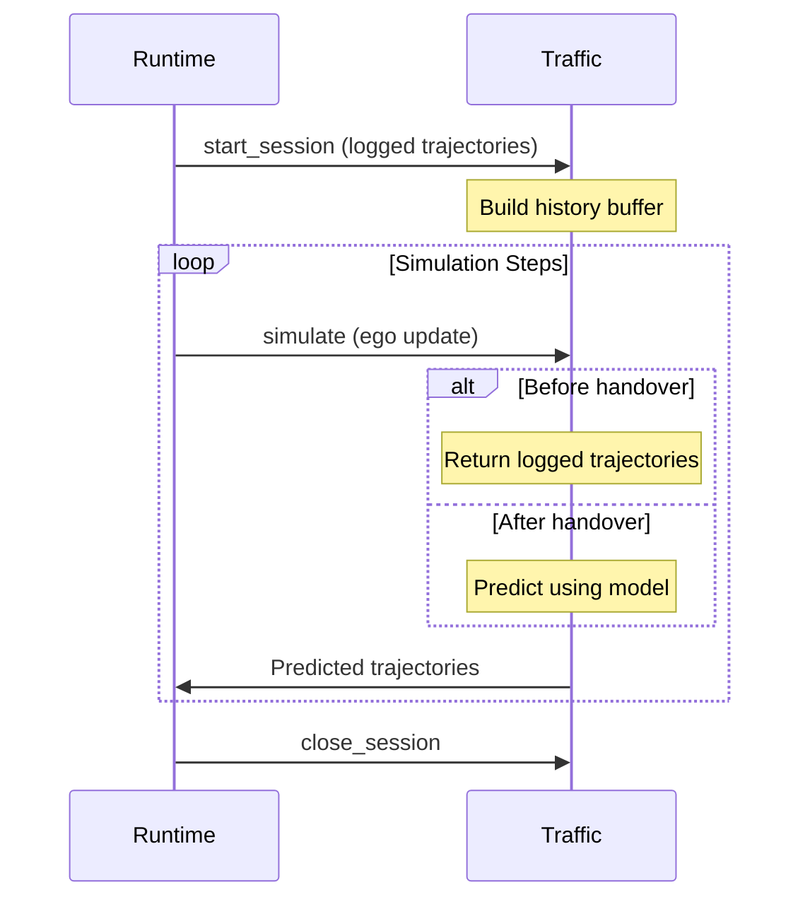

The Traffic Service simulates background vehicles (non-ego actors) in the scene. It predicts realistic trajectories for traffic participants based on logged data and learned models.

## Service Definition

```protobuf
service TrafficService {
    rpc start_session (TrafficSessionRequest) returns (common.SessionRequestStatus);
    rpc close_session (TrafficSessionCloseRequest) returns (common.Empty);
    rpc simulate (TrafficRequest) returns (TrafficReturn);
    rpc get_metadata (common.Empty) returns (TrafficModuleMetadata);
    rpc shut_down (common.Empty) returns (common.Empty);
}
```

## Methods

### start_session

Initialize a traffic simulation session with scene and actor data.

<ParamField body="session_uuid" type="string" required>
  Unique identifier for this traffic session
</ParamField>

<ParamField body="map_id" type="string" required>
  Map identifier for road network information
</ParamField>

<ParamField body="random_seed" type="uint64" required>
  Random seed for reproducible traffic behavior
</ParamField>

<ParamField body="logged_object_trajectories" type="ObjectTrajectory[]" required>
  Initial trajectories from logged data
  
  <Expandable title="ObjectTrajectory">
    <ParamField body="aabb" type="AABB">
      Object bounding box dimensions (meters)
    </ParamField>
    
    <ParamField body="trajectory" type="Trajectory">
      Active transform local→aabb for bounding box center.
      Each pose represents the object center at a timestamp.
    </ParamField>
    
    <ParamField body="object_id" type="string">
      Unique object identifier (persistent across frames)
    </ParamField>
    
    <ParamField body="is_static" type="bool">
      Whether object is static (e.g., parked car, building)
    </ParamField>
  </Expandable>
</ParamField>

<ParamField body="handover_time_us" type="uint64" optional>
  Earliest time when traffic model takes control (microseconds).
  
  Objects appearing later will be handed over after `minimum_history_length` 
  steps of log history, but not before `handover_time_us`.
</ParamField>

### simulate

Advance traffic simulation and get predicted trajectories.

<ParamField body="session_uuid" type="string" required>
  Session identifier
</ParamField>

<ParamField body="time_query_us" type="uint64" required>
  Time for which predictions are requested (microseconds)
</ParamField>

<ParamField body="object_trajectory_updates" type="ObjectTrajectoryUpdate[]">
  Updates for objects not controlled by traffic model (primarily ego vehicle).
  Must include poses until at least `time_query_us`.
  
  <Expandable title="ObjectTrajectoryUpdate">
    <ParamField body="object_id" type="string">
      Object identifier to update
    </ParamField>
    
    <ParamField body="trajectory" type="Trajectory">
      Updated trajectory for the object (active transform local→aabb)
    </ParamField>
  </Expandable>
</ParamField>

<ResponseField name="object_trajectory_updates" type="ObjectTrajectoryUpdate[]">
  Updated trajectories for all objects in the scene.
  
  The last pose in each trajectory is the predicted pose at `time_query_us`.
  
  <Note>
    Maintains the order of objects from `TrafficSessionRequest.logged_object_trajectories`.
  </Note>
</ResponseField>

### get_metadata

Query traffic module capabilities and requirements.

<ResponseField name="version_id" type="VersionId">
  Traffic module version information
</ResponseField>

<ResponseField name="minimum_history_length_us" type="uint64">
  Required history duration before handover (microseconds).
  
  Traffic model needs this much historical data before taking control of an actor.
</ResponseField>

<ResponseField name="supported_map_ids" type="string[]">
  List of map IDs supported by this traffic module
</ResponseField>

### close_session

Release resources for a traffic session.

<ParamField body="session_uuid" type="string" required>
  Session identifier to close
</ParamField>

## Usage Example

From `alpasim_runtime/services/traffic_service.py`:

```python
from alpasim_grpc.v0 import traffic_pb2, traffic_pb2_grpc
from alpasim_grpc.v0.common_pb2 import AABB, Trajectory
import grpc

# Connect to traffic service
channel = grpc.insecure_channel('localhost:50054')
traffic_stub = traffic_pb2_grpc.TrafficServiceStub(channel)

# Query metadata
metadata = traffic_stub.get_metadata(Empty())
print(f"Traffic version: {metadata.version_id.version_id}")
print(f"Min history: {metadata.minimum_history_length_us / 1e6:.1f}s")
print(f"Supported maps: {metadata.supported_map_ids}")

# Prepare logged trajectories
logged_objects = [
    traffic_pb2.ObjectTrajectory(
        object_id="vehicle_001",
        aabb=AABB(size_x=4.5, size_y=2.0, size_z=1.5),
        trajectory=background_trajectory,
        is_static=False
    ),
    traffic_pb2.ObjectTrajectory(
        object_id="vehicle_002",
        aabb=AABB(size_x=5.0, size_y=2.1, size_z=1.6),
        trajectory=another_trajectory,
        is_static=False
    )
]

# Start session
session_request = traffic_pb2.TrafficSessionRequest(
    session_uuid="my-traffic-session",
    map_id="waymo_sf_001",
    random_seed=42,
    logged_object_trajectories=logged_objects,
    handover_time_us=5000000  # 5 seconds
)
traffic_stub.start_session(session_request)

# Simulate traffic
for timestep_us in range(0, 10000000, 100000):  # 10s at 10Hz
    # Update ego vehicle trajectory
    ego_update = traffic_pb2.ObjectTrajectoryUpdate(
        object_id="ego",
        trajectory=current_ego_trajectory
    )
    
    # Request traffic predictions
    request = traffic_pb2.TrafficRequest(
        session_uuid="my-traffic-session",
        time_query_us=timestep_us,
        object_trajectory_updates=[ego_update]
    )
    
    response = traffic_stub.simulate(request)
    
    # Process predicted trajectories
    for obj_update in response.object_trajectory_updates:
        predicted_pose = obj_update.trajectory.poses[-1]
        print(f"Object {obj_update.object_id} at {predicted_pose.pose.vec}")

# Clean up
traffic_stub.close_session(
    traffic_pb2.TrafficSessionCloseRequest(session_uuid="my-traffic-session")
)
```

## Traffic Model Behavior

The traffic service follows this pattern:

1. **Log Replay Phase**: During initial frames, traffic follows logged trajectories
2. **Handover**: After `minimum_history_length_us` of history, model takes control
3. **Prediction**: Model predicts future behavior conditioned on:
   - Road network geometry (from `map_id`)
   - Historical trajectories
   - Ego vehicle behavior
   - Other traffic participants



## Coordinate Frames

<Note>
  All trajectories use **active transforms local→aabb** where:
  
  - **Local**: World/map coordinate system
  - **AABB**: Center of object's axis-aligned bounding box
  
  This is consistent with the physics service coordinate convention.
</Note>

## Configuration

Traffic model parameters are configured via runtime config:

```yaml
# Example runtime config
traffic:
  handover_time_us: 5000000  # 5 seconds
  prediction_horizon_us: 8000000  # 8 seconds
```

## Object Tracking

<Note>
  Object IDs must be stable across frames. The traffic service uses these IDs to:
  
  - Maintain trajectory history
  - Track handover timing
  - Associate predictions with objects
  
  Ensure your data loader provides consistent IDs from scene recordings.
</Note>

## Related

- [Physics Service](/api/grpc/physics) - Adjusts traffic poses for ground
- [SensorSim Service](/api/grpc/sensorsim) - Renders traffic actors
- [Runtime Module](/api/runtime) - Orchestrates traffic simulation