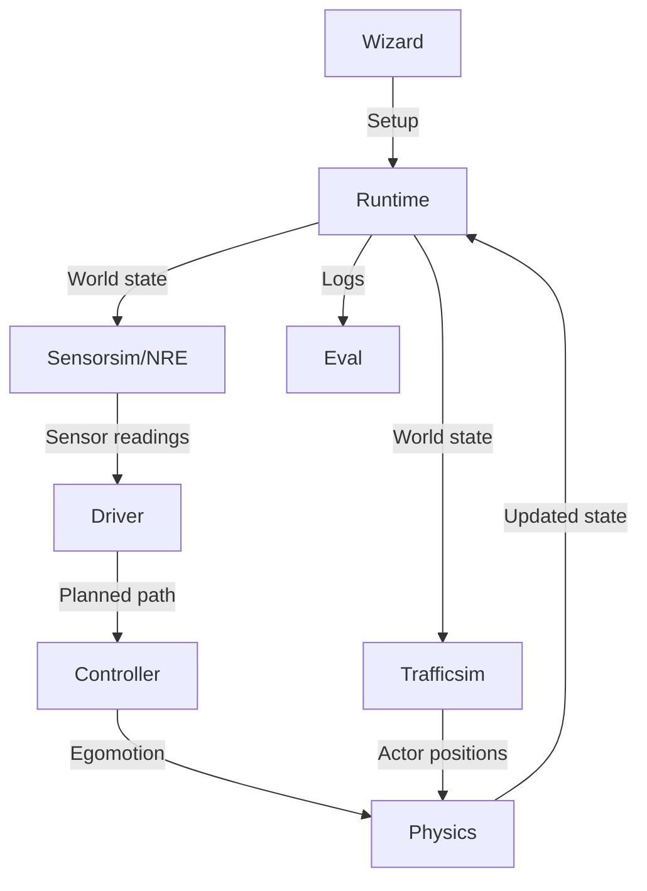

AlpaSim is an autonomous vehicle simulator built as a collection of microservices that communicate via gRPC. This architecture enables horizontal scalability and allows different components to be deployed and scaled independently.

## Core principles

AlpaSim is designed around three core principles:

1. **Sensor fidelity** - High-quality sensor simulation for realistic testing
2. **Horizontal scalability** - Microservices can be replicated based on computational needs
3. **Hackability for research** - Python implementation accessible to researchers

<Note>
Real-time and very precise physics are **non-goals** of AlpaSim. The simulator prioritizes sensor fidelity and scalability over physics accuracy.
</Note>

## Microservices overview

The simulator consists of the following core services:

- **Runtime** - Drives the simulation loop and coordinates all services
- **Driver** - Runs the egovehicle policy network (the autonomous driving model)
- **Controller** - Models vehicle controller and dynamics
- **Physics** - Applies ground constraints to keep vehicles on the road
- **Sensorsim** - Neural Rendering Engine (NRE) for sensor simulation
- **Trafficsim** - Neural traffic simulator for non-ego actors (coming soon)
- **Eval** - Evaluation module that processes logs to compute metrics

All services communicate using a gRPC protocol defined in `src/grpc/`.

## Data flow

The simulation follows a logical flow through each timestep:

### Simulation loop steps

1. **Wizard** sets up the simulation configuration and launches the microservices
2. **Runtime** maintains the world state and orchestrates the simulation loop
3. World state (bounding boxes) is sent to **Trafficsim** to actuate non-ego actors
4. World state is used by **Sensorsim (NRE)** to render camera frames for the ego vehicle
5. **Driver** uses sensor readings to make driving decisions and plan trajectories
6. Planned path is sent to **Controller** which models vehicle dynamics and provides egomotion
7. Both ego and actor actuations are sent to **Physics** which applies ground constraints
8. Updated state returns to **Runtime** which logs it and continues the loop
9. **Eval** module processes logs after simulation to compute metrics

<Info>
The runtime acts as a central hub for all communications and can function as a load balancer between service replicas.
</Info>

## Deployment architecture

The software implementation places the runtime at the center as a node for all communications:

- **Runtime** is a gRPC client that must know the addresses of all other microservices
- **Other services** are server daemons that make no requests of their own
- Services can be replicated according to computational requirements:
  - Typical load: `ego policy > sensor sim > controller sim > traffic sim > physics sim`

<Warning>
The runtime is as I/O intensive as all other services **combined** because it routes all communication.
</Warning>

### Deployment options

Containers can be run on arbitrary machines as long as:
- Runtime knows all service addresses
- Filesystem mounts contain necessary files
- Network connectivity exists between services

The repository supports:
- Single-machine deployment via `docker compose`
- Multi-machine deployment via `slurm`
- Custom deployments with manual service orchestration

## Source code

The microservices can be found in the source repository:

- [`/src/runtime`](https://github.com/NVlabs/alpasim/tree/main/src/runtime) - Simulation runtime
- [`/src/driver`](https://github.com/NVlabs/alpasim/tree/main/src/driver) - Driving policy service
- [`/src/controller`](https://github.com/NVlabs/alpasim/tree/main/src/controller) - Vehicle controller + model
- [`/src/physics`](https://github.com/NVlabs/alpasim/tree/main/src/physics) - Ground-mesh interaction modeling
- [`/src/eval`](https://github.com/NVlabs/alpasim/tree/main/src/eval) - Evaluation framework
- [`/src/grpc`](https://github.com/NVlabs/alpasim/tree/main/src/grpc) - gRPC protocol definitions
