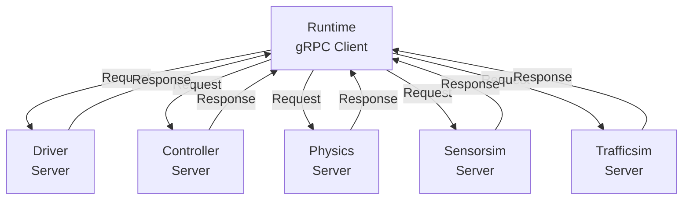

AlpaSim consists of several microservices that work together to create a complete autonomous vehicle simulation. Each service has a specific responsibility and communicates via gRPC.

## Service overview

<Accordion title="Runtime - Simulation orchestrator">
The runtime is the central coordinator of the simulation.

**Location:** `/src/runtime`

**Responsibilities:**
- Drives the main simulation loop
- Maintains the world state
- Coordinates all service communications
- Acts as a load balancer for replicated services
- Generates synchronized logs
- Manages simulation timing and timesteps

**Communication pattern:**
- **Role:** gRPC client
- **Connects to:** All other services
- **Must know:** Addresses of all microservices

<Warning>
The runtime is as I/O intensive as all other services combined since it routes all communication.
</Warning>
</Accordion>

<Accordion title="Driver - Ego vehicle policy">
The driver service runs the autonomous driving policy network.

**Location:** `/src/driver`

**Responsibilities:**
- Executes the egovehicle policy network
- Processes sensor inputs
- Generates driving trajectories
- Makes planning decisions

**Communication pattern:**
- **Role:** gRPC server
- **Receives:** Sensor data, ego state, route information
- **Returns:** Planned trajectory in local frame

**Coordinate frames:**
- Receives noised ego position in `local` frame
- Returns waypoints in what it thinks is `local` frame (actually noised)
- Runtime translates from noisy frame to true `local` frame

<Info>
The driver typically has the highest computational requirements of all services, especially when using neural network policies.
</Info>
</Accordion>

<Accordion title="Controller - Vehicle dynamics">
The controller models the vehicle controller and dynamics.

**Location:** `/src/controller`

**Responsibilities:**
- Models vehicle controller behavior
- Simulates vehicle dynamics
- Provides egomotion estimates
- Translates planned paths to vehicle actuation

**Communication pattern:**
- **Role:** gRPC server
- **Receives:** Current `pose_local_to_rig`, velocities, reference trajectory in `rig` frame
- **Returns:** Future `local->rig` poses and estimates

**Example from source:**
```python
# From src/controller/alpasim_controller/system.py
current_pose_local_to_rig = self._trajectory.last_pose.to_grpc_pose_at_time(
    current_timestamp
)

return Response(
    pose_local_to_rig=current_pose_local_to_rig,
    pose_local_to_rig_estimated=current_pose_local_to_rig,
)
```
</Accordion>

<Accordion title="Physics - Ground constraints">
The physics service applies physical constraints to keep vehicles grounded.

**Location:** `/src/physics`

**Responsibilities:**
- Applies ground mesh constraints
- Ensures vehicles stay on the road surface
- Constrains both ego vehicle and traffic actors
- Provides physically plausible motion

**Communication pattern:**
- **Role:** gRPC server
- **Receives:** Ego and traffic poses as `local -> AABB` transformations
- **Returns:** Constrained poses in same frame

<Note>
Physics precision is a non-goal. The physics service provides "good enough" constraints to keep vehicles on roads, not high-fidelity physics simulation.
</Note>
</Accordion>

<Accordion title="Sensorsim - Neural rendering">
The sensorsim service uses Neural Rendering Engine (NRE) for sensor simulation.

**Location:** Separate NRE service (integration details in `/src/grpc`)

**Responsibilities:**
- Renders camera frames using neural rendering
- Provides high-fidelity sensor simulation
- Simulates camera responses to world state
- Handles multiple camera configurations

**Communication pattern:**
- **Role:** gRPC server
- **Receives:** 
  - Rig trajectory in `local` frame
  - Per-camera calibration `rig->sensor_pose`
  - `local->AABB` trajectories for dynamic objects
- **Returns:** Rendered camera images

**Computational requirements:**
- Second-highest load after driver
- Typically requires GPU acceleration
- Benefits significantly from horizontal scaling
</Accordion>

<Accordion title="Trafficsim - Non-ego actors">
The traffic simulation service actuates non-ego actors.

**Location:** Coming soon

**Responsibilities:**
- Simulates pedestrians, vehicles, and other actors
- Neural traffic behavior modeling
- Provides realistic traffic patterns
- Actuates non-ego entities

**Communication pattern:**
- **Role:** gRPC server
- **Receives:** World state bounding boxes in `local -> AABB` frame
- **Returns:** Updated actor positions and states

<Info>
The neural traffic simulator is under development. Current versions may use simpler traffic models.
</Info>
</Accordion>

<Accordion title="Eval - Metrics and evaluation">
The evaluation module processes simulation logs to compute metrics.

**Location:** `/src/eval`

**Responsibilities:**
- Processes simulation logs after completion
- Computes autonomous driving metrics
- Analyzes driving performance
- Generates evaluation reports

**Communication pattern:**
- **Role:** Standalone tool (not in simulation loop)
- **Reads:** Log files produced by runtime
- **Outputs:** Metrics and evaluation results

**Note:** Eval runs outside the main simulation loop.
</Accordion>

## gRPC communication

All services communicate using gRPC with Protocol Buffers.

### Protocol definitions

The gRPC API is defined in `/src/grpc/`:

```python
# Example: Pose representation in gRPC
message Pose {
    Vec3 vec = 1;
    Quat quat = 2;
}

message PoseAtTime {
    Pose pose = 1;
    int64 timestamp_us = 2;
}
```

### Service communication pattern

1. **Runtime initiates** all requests
2. **Services respond** with computed results
3. **No service-to-service** communication
4. **Runtime coordinates** the simulation loop



## Scalability and deployment

### Horizontal scaling

Services can be replicated based on computational needs:

<Tabs>
  <Tab title="Docker Compose">
    Single-machine deployment with all services:
    
    ```yaml
    # docker-compose.yml example
    services:
      runtime:
        # Runtime service
      driver:
        # Driver service
        deploy:
          replicas: 1
      sensorsim:
        # Sensorsim service
        deploy:
          replicas: 3  # Scale based on load
    ```
  </Tab>
  
  <Tab title="Slurm">
    Multi-machine deployment with job scheduling:
    
    - Services allocated to appropriate hardware
    - GPU nodes for sensorsim and driver
    - CPU nodes for physics and controller
    - Coordinated through Slurm job arrays
  </Tab>
  
  <Tab title="Custom">
    Manual deployment requirements:
    
    - Runtime must know all service addresses
    - Filesystem mounts must contain necessary files
    - Network connectivity between all services
    - Load balancing handled by runtime
  </Tab>
</Tabs>

### Service discovery

The runtime needs to be configured with service addresses:

- Services run as daemons on known ports
- Runtime configuration specifies service endpoints
- No dynamic service discovery required
- Simple and predictable networking model

## Performance considerations

### Computational load hierarchy

Typical resource requirements (highest to lowest):

1. **Driver** - Neural network inference
2. **Sensorsim** - Neural rendering
3. **Controller** - Vehicle dynamics simulation
4. **Trafficsim** - Traffic simulation
5. **Physics** - Ground constraints

### Bottlenecks

- **Runtime I/O** - All communication flows through runtime
- **Sensorsim rendering** - GPU-intensive neural rendering
- **Driver inference** - Neural network forward passes

### Optimization strategies

- Scale expensive services (sensorsim, driver) horizontally
- Use GPU hardware for rendering and inference
- Optimize runtime communication patterns
- Batch operations where possible
